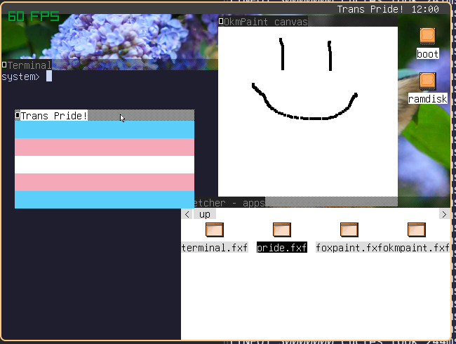

# fox33: A WIP [fox32](https://github.com/fox32-arch) emulator written in c3

> [!NOTE]
> It is recommended to build in a nix environment:
> ```console
> $ nix develop --impure
> ```

> [!WARNING]
> This project is an example of what happens when you use too many macros, don't do what I did and your code will be so much more maintainable



## todo:

- [x] Fix that `0x04000000` bug (so painful :()
- [x] Run fox32rom successfully
- [x] Initial Gui & see fox32rom framebuffer
- [x] Implement Gui overlays
- [x] I/O stuff:
  - [x] mounting disks
  - [x] mouse
  - [x] keyboard
  - [x] rtc
- [x] Interrupts/Exceptions
- [x] boot fox32os
- [x] Get fox32rom functioning completely
- [x] Get fox32os functioning completely
  - [ ] get all fox32os apps functioning (only missing some simple instructions)
- [ ] Implement all instructions fully
- [ ] MMU
- [ ] swap sp so I can run minita
- [ ] internal refactoring of error handling
- [ ] refactor convenience macros to be more convenient & less awfully hacky (they will bever be entirely hack free tho (cry about my overuse of macros lerno >:3))
- [ ] Any other things I can think of

## building:

```console
$ c3c build -D <build flag> -O5
```

### build flags:
 - DEBUG -> print almost too many debug logs
 - PERF -> print the time taken to execute 30M instructions (target <= 1 second for 30Mhz)
 - NOWARN -> silence runtime warnings, mostly unimplemented methods
 - FOXLOG -> print debug logs in the exact same format as the fox32 reference emulator
 - MORE_PERF -> inlines all instructions for a performance boost at the cost of compile-time

## usage:

```console
$ ./build/fox33 <boot rom> <disk0> <disk1> <disk2> <disk3> <index out of bounds error>
```
